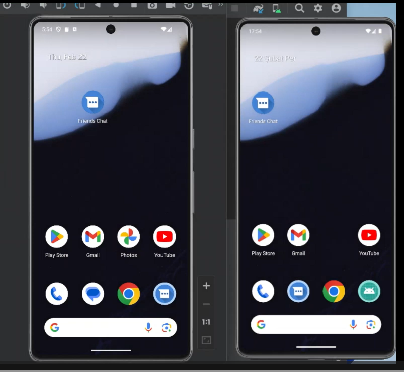
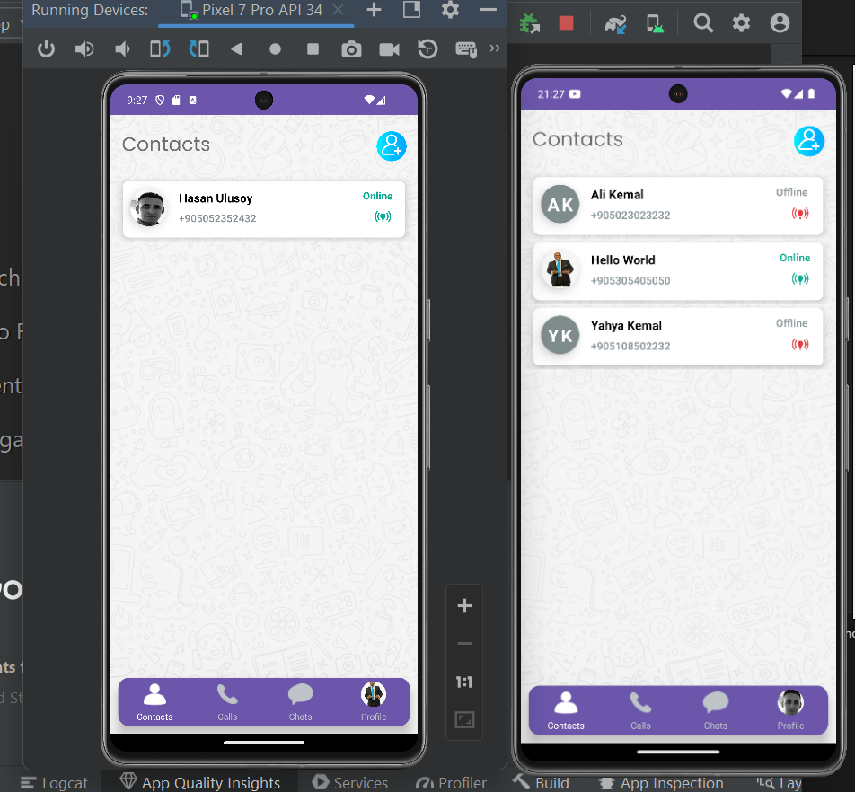
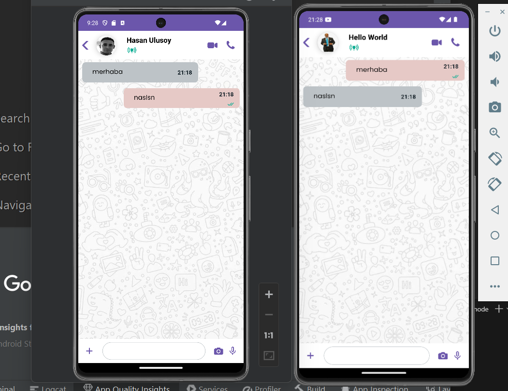
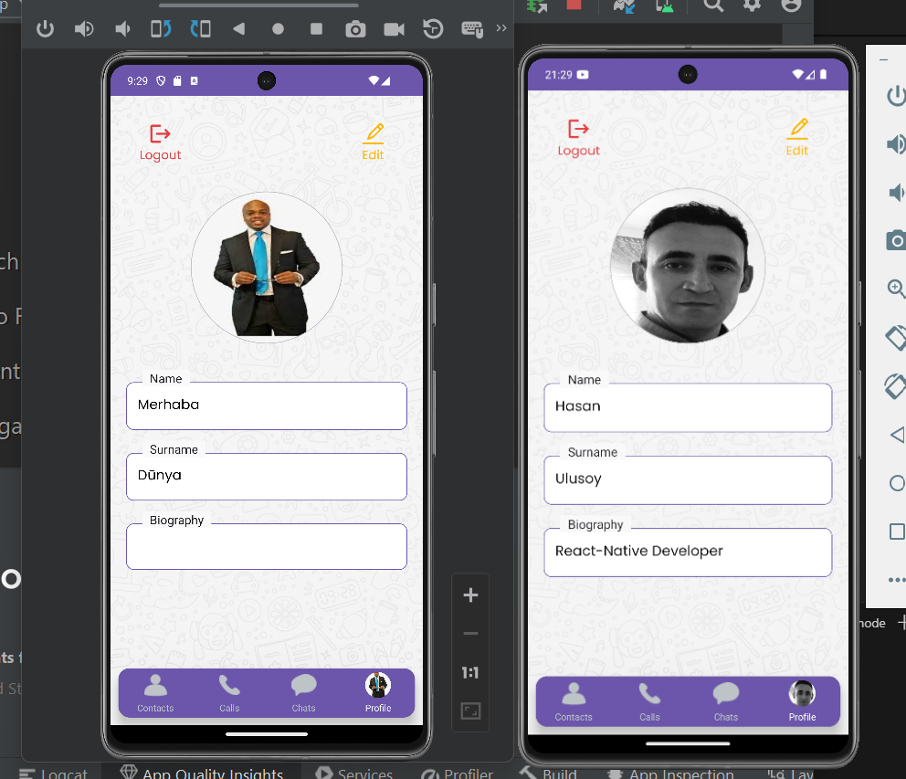

# What's Up - React Native Mesaj Uygulaması
What's Up, React Native kullanarak geliştirilen kapsamlı bir mesajlaşma uygulamasıdır. Bu uygulama, telefon numarasıyla kayıt oluşturma, SMS ile güvenlik doğrulaması, rehber entegrasyonu, canlı sohbet ve profil sayfaları gibi birçok özelliği içerir.

# Özellikler
- Telefon Numarasıyla Kayıt Olma: Kullanıcılar, telefon numaralarıyla kolayca kayıt oluşturabilirler.

- Güvenlik Kontrolü: Kayıt olurken, SMS ile güvenlik doğrulaması sağlanır, böylece güvenli bir giriş sağlanır.
(sabit bir veriden kontrol yapılmıştır.)

- Rehber Entegrasyonu: Kullanıcılar, rehberlerinden kişiler ekleyebilir ve bu kişilerle iletişime geçebilirler.

- Canlı Sohbet: Kullanıcılar, telefon numaralarını ekleyerek sohbet listesi oluşturabilir ve bu sohbetlerde mesajlaşabilirler.

- Arama Özelliği: Kullanıcılar, uygulama içinde arama yaparak mesajlarını kolayca bulabilirler.  (Bu özellik şu an eklenmeiştir.)

- Profil Sayfaları: Kullanıcılar, kendi profil sayfalarını özelleştirebilir ve profil fotoğraflarını ekleyebilirler.

- Kişi eğer kayıtlı ise kişi ekleme sayfasında tele numarası ile aram yapılarak kayıt sorgulaması yapılabilir.

# Kullanılan Kütüphaneler
- Proje geliştirilirken aşağıdaki kütüphanelerden faydalanılmıştır:

- Navigasyon: React Navigation kullanılarak kullanıcı arayüzü yönlendirmeleri sağlanmıştır.

- Animasyonlar: React Native Animations kullanılarak kullanıcı arayüzünde animasyonlar eklenmiştir.

- Cihaz Bilgisi Alma: React Native Device Info kullanılarak cihaz bilgileri alınmıştır.

- İnternet Bağlantısı Kontrolü: React Native NetInfo kullanılarak cihazın internet bağlantısı kontrol edilmiştir.

- Cihaz Kamera ve Dosya Erişimi: React Native Image Picker kullanılarak kamera ve galeri erişimi sağlanmıştır.

- Cihaz Hafızasına Kaydetme: React Native AsyncStorage kullanılarak cihaz hafızasına veri kaydedilmiştir.

- Firebase İle Sanal Sunucu: Firebase kullanılarak uygulamanın arka planında bir sunucu sağlanmıştır.

- Bilgilendirme Mesajları: React Native Toast Message kullanılarak kullanıcıya bilgilendirme mesajları gösterilmiştir.

- Nasıl Başlanır

Projeyi yerel ortamınıza klonlayın:
git clone https://github.com/your-username/whats-up.git

Proje dizinine gidin ve bağımlılıkları yükleyin:
cd whats-up
npm install

Uygulamayı başlatmak için:
npm start
Katkıda Bulunma

## Preview

# What-sUp-1_React-Native
# FirebaseChat-ContextApi-React-Native
# FirebaseChat-ContextApi-React-Native
# FirebaseChat-ContextApi-React-Native
# FirebaseChat-ContextApi-React-Native
